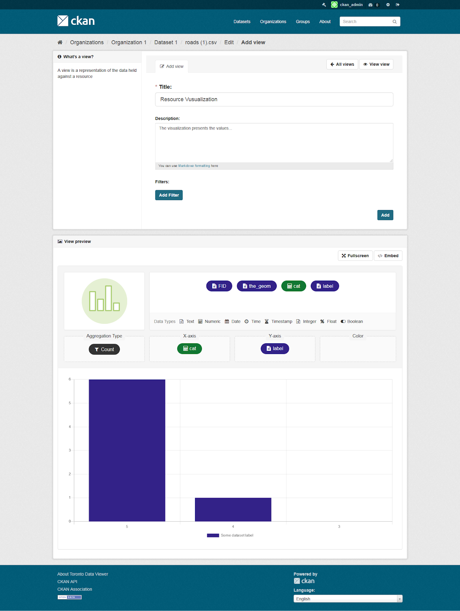
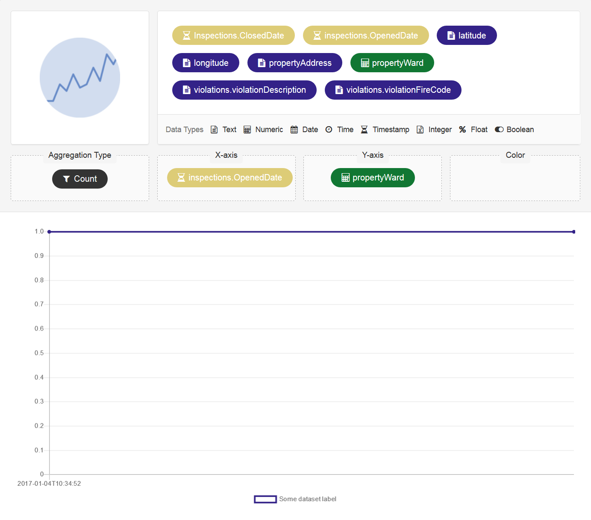
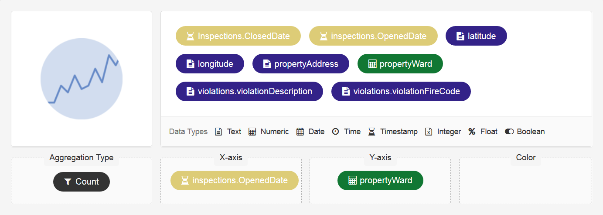
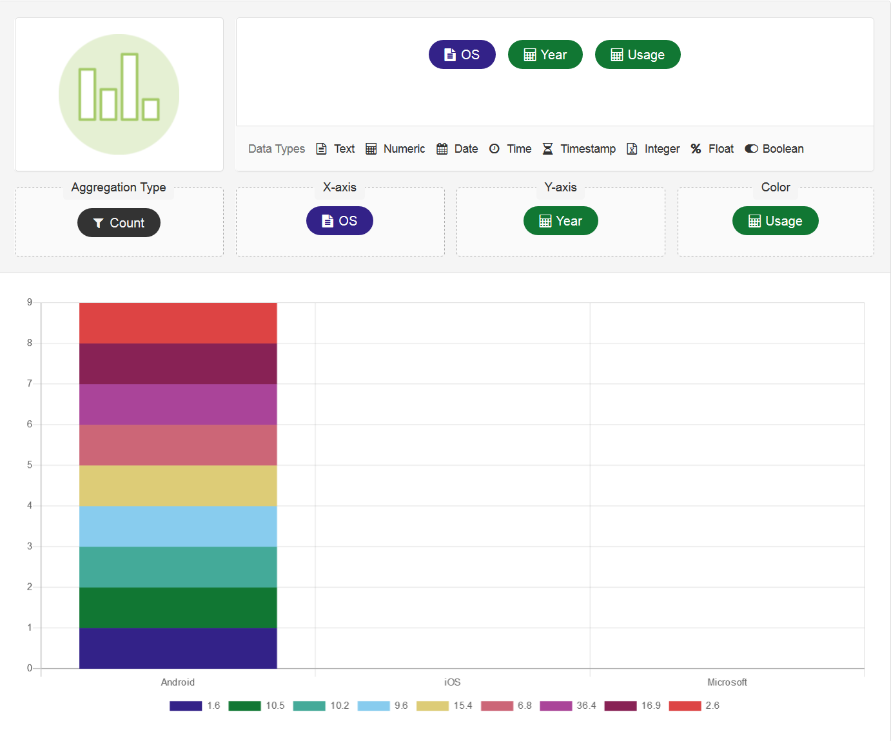
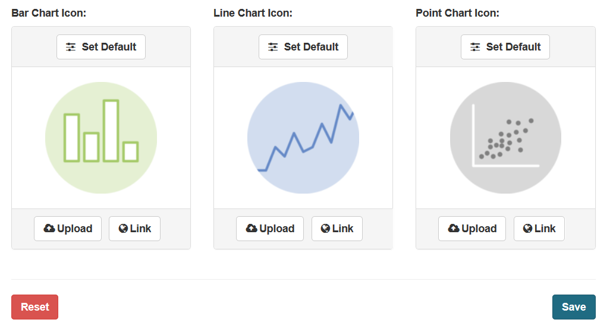
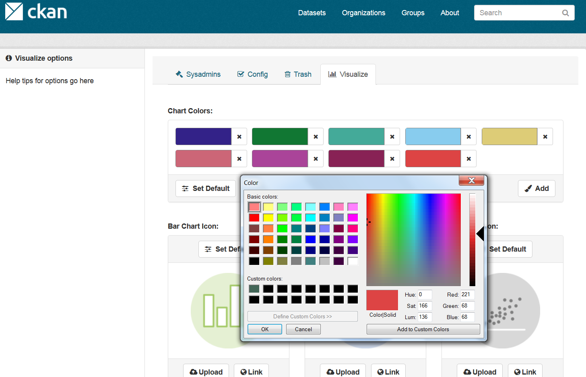

.. You should enable this project on travis-ci.org and coveralls.io to make
   these badges work. The necessary Travis and Coverage config files have been
   generated for you.

.. image:: https://travis-ci.org/keitaroinc/ckanext-visualize.svg?branch=master
    :target: https://travis-ci.org/keitaroinc/ckanext-visualize

.. image:: https://coveralls.io/repos/github/keitaroinc/ckanext-visualize/badge.svg?branch=master
    :target: https://coveralls.io/github/keitaroinc/ckanext-visualize?branch=master

=============
ckanext-visualize
=============

.. Put a description of your extension here:
   What does it do? What features does it have?
   Consider including some screenshots or embedding a video!

CKAN extension which allows users to visualize data in a very efficient and
intuitive way, in a simple to use User Interface. The viewer automatically
creates the most meaningful chart based on the chosen columns. Administrators
can create predefined charts and easily configure them based on the needs.

--------
Features
--------

- **Intuitive and easy to use**. This CKAN extension enables users to easily
build and visualize charts that are simple to use.
- **Predefined charts**. Administrators can create meaningful charts for users
as CKAN views, so they can immediately visualize and understand the data.
- **Standalone chart viewer**. The extension allows the chart viewer to be
embedded on third-party websites without creating CKAN views.
- **Intelligent chart type selection**. Depending on the data types of the
columns that are chosen, the extension automatically chooses the most
appropriate type to visualize the data.
- **Drag-and-drop columns**. Creating a chart is as easy as dragging a column
from the list of all available columns into the X or Y axis.
- **Color attribute**. Data in the chart can be grouped based on the selected
column and colored for each distinct value.
- **Visually distinct columns**. All available columns that can be dragged are
color coded based on the data type of the column and have a specific icon
defined in a legend.
- **Chart types**. The viewer supports the following types of chart: bar, line
and point, with more coming in the next release.
- **Customizable color palette**. The extension comes with a default color
palette that is using carefully chosen colors that are accessible, with the
possibility to change them and add additional ones from a configuration page.
- **Customizable chart type icons**. For each supported chart type, there is a
corresponding icon that can be customized from a configuration page.
- **Mobile support**. Drag-and-drop functionality is supported on mobile
devices as well.
- **Responsive**. The extension is optimized to work across many screen sizes,
from mobile to desktop.

-----------------
Used technologies
-----------------

- HTML, CSS, Bootstrap, JavaScript, jQuery, Chart.js, SortableJS, Python

-----------
Screenshots
-----------

- Predefined chart

- Intelligent chart type selection

- Drag-and-drop columns

- Color attributes

- Chart colors
.. image:: screenshots/chart-colors.png

- Data types
.. image:: screenshots/data-types.png

- Chart types

- Customizable color palette

------------
Requirements
------------

This extension is developed and tested on CKAN 2.8

------------
Installation
------------

.. Add any additional install steps to the list below.
   For example installing any non-Python dependencies or adding any required
   config settings.

To install ckanext-visualize:

1. Activate your CKAN virtual environment, for example::

     . /usr/lib/ckan/default/bin/activate

2. Install the ckanext-visualize Python package into your virtual environment::

     pip install ckanext-visualize

3. Add ``visualize`` to the ``ckan.plugins`` setting in your CKAN
   config file (by default the config file is located at
   ``/etc/ckan/default/production.ini``).

4. Restart CKAN. For example if you've deployed CKAN with Apache on Ubuntu::

     sudo service apache2 reload

------------------------
Development Installation
------------------------

To install ckanext-visualize for development, activate your CKAN virtualenv and
do::

    git clone https://github.com/keitaroinc/ckanext-visualize.git
    cd ckanext-visualize
    python setup.py develop
    pip install -r dev-requirements.txt

-----------------
Running the Tests
-----------------

To run the tests, do::

    nosetests --nologcapture --with-pylons=test.ini

To run the tests and produce a coverage report, first make sure you have
coverage installed in your virtualenv (``pip install coverage``) then run::

    nosetests --nologcapture --with-pylons=test.ini --with-coverage --cover-package=ckanext.visualize --cover-inclusive --cover-erase

-----------------
Chart icons
-----------------

The default icons that are used for the types of chart are taken from `The R Graph Gallery <https://www.r-graph-gallery.com>`_.

-----------------
Illustration
-----------------

The illustration that is used is a modified version based on the open-source illustration from `Katerina Limpitsouni <https://undraw.co/>`_.
